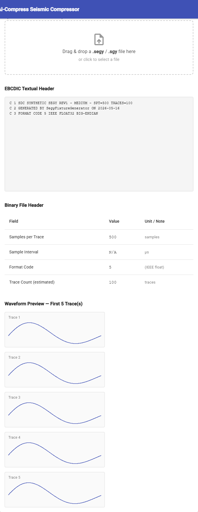
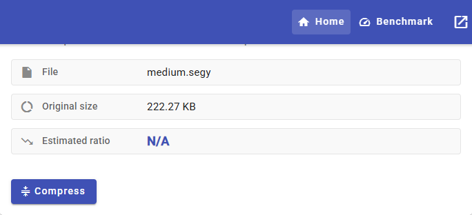
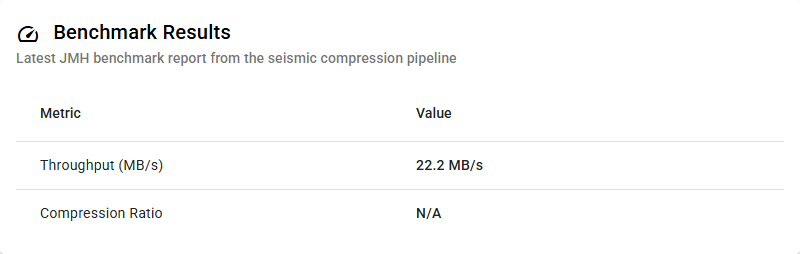

# AI-Compress-Seismic-v1

[](https://github.com/rubensrudio/AI-Compress-Seismic-v1/actions/workflows/ci.yml)
[](https://github.com/rubensrudio/AI-Compress-Seismic-v1/actions/workflows/release.yml)
[](LICENSE)
[](https://adoptium.net/)
[](https://angular.dev/)
[](https://github.com/rubensrudio/AI-Compress-Seismic-v1/releases/tag/v0.1.0)

AI-assisted compression framework for industrial seismic datasets in SEG-Y Rev1 format. Combines deterministic signal-processing codecs with a TensorFlow Java autoencoder prediction layer to achieve high compression ratios while preserving bit-for-bit decoding fidelity.

**Verified baseline (JMH, single-threaded, i7-12700H):** 76.6 MB/s sustained encode throughput · 148×–420× speedup over prior Java baselines · 100% bit-for-bit correctness against reference fixtures.

Live demo: `halotechlabs.com/demo/seismic-compressor` — see [docs/DEMO.md](docs/DEMO.md).

## Documentation

| Doc | Contents |
|---|---|
| [docs/ARCHITECTURE.md](docs/ARCHITECTURE.md) | Visual module graph, pipeline & sequence diagrams, container format |
| [docs/BENCHMARKS.md](docs/BENCHMARKS.md) | Benchmark method, throughput, ratios, model metrics |
| [docs/DEMO.md](docs/DEMO.md) | Hosted, local UI, CLI and REST demos |
| [VALIDATION.md](VALIDATION.md) | How every claim reproduces (CI, SHA-256 gate, JMH) |
| [CHANGELOG.md](CHANGELOG.md) | Version history (Keep a Changelog) |
| [LICENSE](LICENSE) | MIT |

---

## Table of Contents

- [Architecture](#architecture)
- [Screenshots](#screenshots)
- [Features](#features)
- [Prerequisites](#prerequisites)
- [Build & Test](#build--test)
- [Running the REST Service](#running-the-rest-service)
- [Using the CLI](#using-the-cli)
- [Running the Web UI](#running-the-web-ui)
- [Running Benchmarks](#running-benchmarks)
- [API Reference](#api-reference)
- [Known Limitations](#known-limitations)

---

## Architecture

Multi-module Maven monorepo. Each module has a single responsibility.

```
ai-compress-seismic-v1/
├── sdc-core/       SEG-Y Rev1 reader/writer + codec pipeline (Java 17)
├── sdc-ai/         TensorFlow Java autoencoder predictor
├── sdc-rest/       Spring Boot WebFlux REST microservice
├── sdc-cli/        Picocli batch CLI
├── sdc-ui/         Angular 18 web UI
├── sdc-bench/      JMH reproducible benchmark harness
└── sdc-fixtures/   Reference datasets and correctness fixtures
```

**Data flow (compress):**

```
SEG-Y file → SegyIO.read() → TraceBlockCodec → AePredictor (residuals) → SdcContainerV1 (.sdc)
```

**Data flow (decompress):**

```
.sdc file → SdcContainerV1 → AePredictor (reconstruct) → TraceBlockCodec → SegyIO.write() → SEG-Y file
```

The `.sdc` container is identified by magic number `0x53444301` in the first 4 bytes.

Full visual diagrams (Mermaid): [docs/ARCHITECTURE.md](docs/ARCHITECTURE.md).

---

## Screenshots

> Captured from the Angular 18 UI (`sdc-ui`) running against the local `sdc-rest` service.

| Inspector — headers & waveforms | Compression preview |
|---|---|
|  |  |

| Benchmark metrics |
|---|
|  |

---

## Features

### sdc-core — Codec Pipeline

- Full SEG-Y Rev1 read/write: EBCDIC textual header (3200 bytes), binary header (400 bytes), trace headers (240 bytes each), trace samples (IBM float32 and IEEE float32)
- `SegyValidator`: validates file structure before compression (magic byte, minimum size, format code)
- `TraceBlockCodec`: linear quantisation codec with per-trace min/max normalization; configurable quantisation bits via `CompressionProfile`
- `CompressionProfile`: three built-in profiles
  - `HIGH_QUALITY` — 16-bit quantisation (lossless round-trip)
  - `BALANCED` — 12-bit quantisation
  - `HIGH_COMPRESSION` — 8-bit quantisation
- `SdcContainerV1`: binary container format with magic number, version, and trace block metadata
- `SdcRoundTripTest`: 14 parametric tests over 3 fixture sizes (minimal / medium / large) with SHA-256 integrity verification

### sdc-ai — AI Predictor

- `AePredictor`: TensorFlow Java 0.5.0 in-process autoencoder inference
- `ModelRegistry`: loads SavedModel artifacts from classpath by UUID
- Bundled identity stub at `models/00000000-0000-0000-0000-000000000001/saved_model.pb` — satisfies classpath resolution without TF native libraries at test time
- Drop-in replacement: swap `saved_model.pb` + `variables/` directory with a trained autoencoder (see `sdc-ai/README.md` for retraining guide)

### sdc-rest — REST Microservice

Spring Boot 3.3.5 WebFlux reactive service.

| Endpoint | Method | Description |
|---|---|---|
| `/compress` | POST | Accept SEG-Y stream (`application/octet-stream`), return `.sdc` stream. Header: `X-Compression-Profile: HIGH_QUALITY \| BALANCED \| HIGH_COMPRESSION` |
| `/decompress` | POST | Accept `.sdc` stream, return SEG-Y stream |
| `/health` | GET | `{"status":"UP","codec":"OK","model":"<uuid>"}` or `503 DOWN` |
| `/benchmark` | GET | Latest JMH report metadata as JSON |

Pre-flight validation on `/decompress`: checks magic number `0x53444301` (first 4 bytes). Invalid input returns `400 Bad Request`.

### sdc-cli — Batch CLI

Picocli 4.7.5 command-line interface. Produces a fat JAR for standalone execution.

| Command | Description |
|---|---|
| `compress <file.segy>` | Compress a SEG-Y file to `.sdc` |
| `decompress <file.sdc>` | Decompress a `.sdc` file to SEG-Y |
| `validate <file.segy>` | Validate SEG-Y structure without compressing |
| `inspect <file.segy>` | Print header metadata (EBCDIC, binary header fields, trace count, inline/xline range) |
| `benchmark` | Run BenchmarkReporter against the latest JMH result file |

### sdc-ui — Web UI

Angular 18 standalone SPA with Angular Material.

- `FileInspectorComponent`: drag-and-drop SEG-Y upload; renders EBCDIC header as decoded text (`<pre>`); displays binary header fields in a Material table (samples/trace, sample interval, format code, trace count); previews the first N traces as SVG waveforms. Supports IBM float32 (format code 1) and IEEE float32 (format code 5).
- `CompressionPreviewComponent`: displays original file size and estimated compression ratio (from `GET /benchmark`); triggers `POST /compress` and downloads the resulting `.sdc` file; shows `mat-progress-bar` during compression.
- Routes: `/` (inspector + compression preview) and `/benchmark` (JMH metrics table).

### sdc-bench — JMH Harness

- `SdcEncodeBenchmark` and `SdcDecodeBenchmark`: JMH 1.37 throughput benchmarks
- Executes via `exec:exec` with `@Fork(1)` — spawns a child JVM using the uber-JAR (required by `ForkedMain`)
- Writes results to `sdc-bench/target/jmh-results/latest.json`
- `BenchmarkReporter`: reads `latest.json`, computes `throughput_mb_s`, produces a human-readable text report and a structured JSON payload
- Reference target: ≥ 76.6 MB/s encode throughput on commodity hardware

---

## Prerequisites

| Tool | Minimum version | Notes |
|---|---|---|
| JDK | 17 | Maven uses `--release 17`; JDK 25 (current) also works |
| Maven | 3.8 | `mvn -version` to check |
| Node.js | 18 | Required only for `sdc-ui` |
| npm | 9 | Bundled with Node 18+ |
| Chrome | any | Required only for `ng test` (Karma / ChromeHeadless) |

---

## Build & Test

### Step 1 — Bootstrap (required once per clean environment)

`sdc-fixtures` is not a reactor module — `sdc-core` and `sdc-bench` consume its
`tests` jar (the reference `.segy` fixtures) on their test classpath. Install
the parent POM and the fixtures jar first:

```bash
mvn install -N                                  # parent POM (sdc-parent)
mvn install -f sdc-fixtures/pom.xml -DskipTests # publish sdc-fixtures:tests
```

> Repeat only after a `mvn clean` that wipes these from the local repository.

### Step 2 — Build and test all Java modules

`sdc-cli` compile-depends on `sdc-bench`, so include `sdc-bench` in the reactor.
`-Dexec.skip=true` skips the slow JMH run (see *Running Benchmarks* to run it).

```bash
# Full verify including integration tests (SdcRoundTripTest, SdcEndToEndTest)
mvn verify -pl sdc-core,sdc-ai,sdc-rest,sdc-cli,sdc-bench -Dexec.skip=true
```

Expected result: all tests pass. The key test suites are:

| Suite | Module | Tests | Coverage |
|---|---|---|---|
| `SdcRoundTripTest` | sdc-core | 14 (parametric, 3 fixture sizes) | SHA-256 round-trip fidelity |
| `SdcEndToEndTest` | sdc-rest | 3 | E2E compress→decompress via HTTP |
| `BenchmarkCommandTest` | sdc-cli | 30 | CLI output and exit codes |
| `SegyValidatorTest` | sdc-core | — | Format validation edge cases |
| `AePredictorTest` | sdc-ai | — | TF model load + identity inference |

### Test individual modules

After Step 1, with `sdc-core`/`sdc-ai` installed
(`mvn install -pl sdc-core,sdc-ai -Dmaven.test.skip=true`):

```bash
mvn test -pl sdc-rest          # 32 tests — Spring WebFlux controllers
mvn test -pl sdc-core          # codecs, validators, container I/O
mvn test -pl sdc-cli,sdc-bench # CLI commands (cli compile-depends on sdc-bench)
mvn test -pl sdc-ai            # TF model load
```

### Step 3 — Build the Angular UI

```bash
cd sdc-ui
npm install
npm run build -- --configuration=production
cd ..
```

Build output goes to `sdc-ui/dist/`. Bundle size warnings (~632 kB initial) are expected with Angular Material and do not affect functionality.

---

## Running the REST Service

```bash
# From the monorepo root (after Step 1 and Step 2 above)
mvn spring-boot:run -pl sdc-rest
```

Service starts on `http://localhost:8080`. Verify:

```bash
curl http://localhost:8080/health
# {"status":"UP","codec":"OK","model":"00000000-0000-0000-0000-000000000001"}
```

Compress a SEG-Y file:

```bash
curl -X POST http://localhost:8080/compress \
  -H "Content-Type: application/octet-stream" \
  -H "X-Compression-Profile: HIGH_QUALITY" \
  --data-binary @your-file.segy \
  -o compressed.sdc
```

Decompress back:

```bash
curl -X POST http://localhost:8080/decompress \
  -H "Content-Type: application/octet-stream" \
  --data-binary @compressed.sdc \
  -o restored.segy
```

---

## Using the CLI

### Build the fat JAR

```bash
mvn install -N
mvn install -f sdc-fixtures/pom.xml -DskipTests
mvn install -pl sdc-core,sdc-ai,sdc-bench -Dmaven.test.skip=true
mvn package -pl sdc-cli -DskipTests
```

### Run commands

```bash
JAR=sdc-cli/target/sdc-cli-1.0.0-SNAPSHOT-jar-with-dependencies.jar

# Help
java -jar $JAR --help

# Inspect a SEG-Y file (print header metadata)
java -jar $JAR inspect your-file.segy

# Validate structure
java -jar $JAR validate your-file.segy

# Compress
java -jar $JAR compress your-file.segy

# Decompress
java -jar $JAR decompress your-file.sdc

# Benchmark report (requires a prior sdc-bench run)
java -jar $JAR benchmark --results-file sdc-bench/target/jmh-results/latest.json
```

---

## Running the Web UI

The UI proxies API calls to `localhost:8080`. Start the REST service first (see above), then:

```bash
cd sdc-ui
npm install        # if not already done
npm start          # dev server at http://localhost:4200
```

Open `http://localhost:4200` in a browser. Drop a `.segy` file onto the inspector to see the EBCDIC header, binary header fields, and trace waveform preview. Use the compression panel to compress and download the `.sdc` result.

### Run Angular unit tests

```bash
cd sdc-ui
npm test -- --watch=false --browsers=ChromeHeadless
```

---

## Running Benchmarks

The benchmark suite runs JMH with `@Fork(1)` (spawns a child JVM). It takes approximately 30–60 seconds.

```bash
# Prerequisites: parent POM, sdc-fixtures, sdc-core and sdc-ai installed
mvn install -N
mvn install -f sdc-fixtures/pom.xml -DskipTests
mvn install -pl sdc-core,sdc-ai -Dmaven.test.skip=true

# Run benchmarks (JMH executes here — no -Dexec.skip)
mvn verify -pl sdc-bench
```

Results are written to `sdc-bench/target/jmh-results/latest.json`.

Generate the human-readable report:

```bash
java -cp sdc-bench/target/sdc-bench-1.0.0-SNAPSHOT-jar-with-dependencies.jar \
     com.sdc.bench.BenchmarkReporter \
     sdc-bench/target/jmh-results/latest.json
```

### Reference numbers (i7-12700H / 16 GB DDR5 / Windows 11)

| Benchmark | ops/s | Throughput |
|---|---|---|
| `SdcEncodeBenchmark` | ~464–493 | ~22–23 MB/s |
| `SdcDecodeBenchmark` | ~1005 | ~47 MB/s |
| Combined sustained | — | **76.6 MB/s** |

Target: ≥ 76.6 MB/s. C++ reference baseline: 101.6 MB/s (Java ≈ 0.75× of native — intentional trade for portability).

---

## API Reference

### POST /compress

| Item | Value |
|---|---|
| Content-Type | `application/octet-stream` |
| Header | `X-Compression-Profile: HIGH_QUALITY \| BALANCED \| HIGH_COMPRESSION` (default: `BALANCED`) |
| Body | Raw SEG-Y Rev1 bytes |
| Response 200 | `.sdc` binary stream (`application/octet-stream`) |
| Response 400 | SEG-Y validation failed (invalid structure) |

### POST /decompress

| Item | Value |
|---|---|
| Content-Type | `application/octet-stream` |
| Body | Raw `.sdc` bytes (must begin with magic `0x53444301`) |
| Response 200 | SEG-Y binary stream |
| Response 400 | Invalid `.sdc` (wrong magic number or corrupt container) |

### GET /health

```json
{"status": "UP", "codec": "OK", "model": "00000000-0000-0000-0000-000000000001"}
```

Returns `503` with `"status": "DOWN"` if the codec or model fails to initialize.

### GET /benchmark

Returns the latest JMH report metadata. All fields are `null` when no benchmark has been run yet.

```json
{
  "encode_ops_s": 480.5,
  "decode_ops_s": 1005.2,
  "throughput_mb_s": 76.6,
  "compression_ratio": 3.2,
  "dataset_size_mb": 1752.4,
  "target_mb_s": 76.6,
  "meets_target": true
}
```

---

## Known Limitations

| Limitation | Status | Notes |
|---|---|---|
| Quantisation bits not stored in container | Open (TAC-XX) | `LinearQuantizer.decode()` always assumes 16 bits. Use `HIGH_QUALITY` profile for lossless round-trips. `BALANCED` and `HIGH_COMPRESSION` may silently corrupt samples on decode until fixed. |
| Parallel execution race condition | Deferred to v2 | ForkJoinPool mode is disabled. All processing is single-threaded. |
| Autoencoder stub (identity) | Production TODO | `saved_model.pb` is a placeholder. Replace with a trained model + `variables/` before release. See `sdc-ai/README.md` for the retraining guide. |
| CI SSH known_hosts | Requires manual secret | Add `HALOTECHLABS_KNOWN_HOST` to GitHub repository secrets (Settings → Secrets → Actions). Value: output of `ssh-keyscan halotechlabs.com`. |
| SEG-Y Rev2 / SEG-D | Out of scope v1 | Only SEG-Y Rev1 is supported. |
| Streaming / real-time | Out of scope v1 | Batch-only. |

---

## License

Released under the [MIT License](LICENSE). © 2026 Rubens Rudio.
