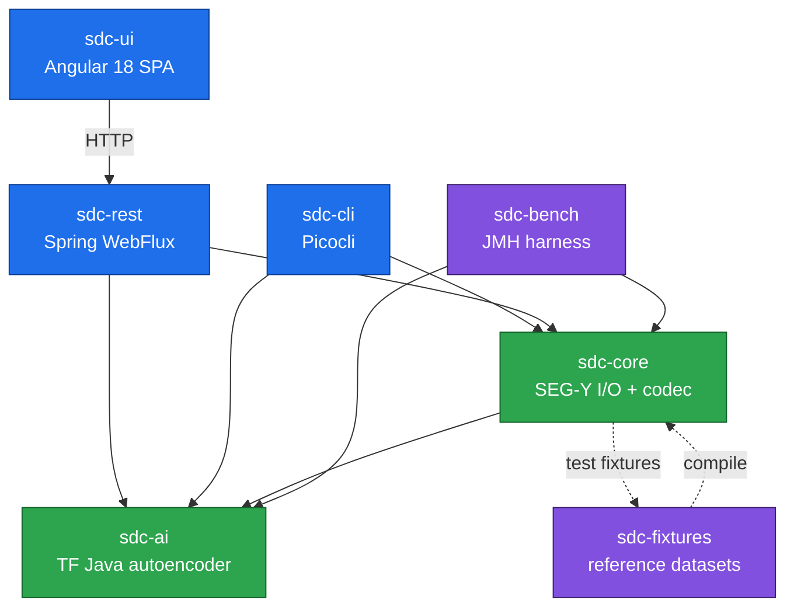
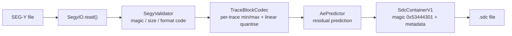
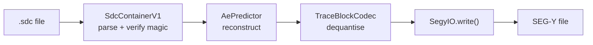
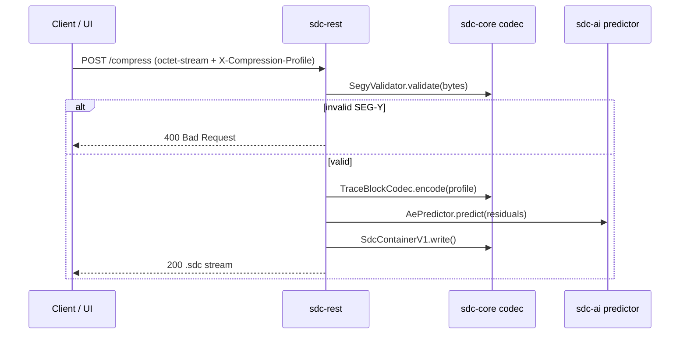

# Architecture

AI-Compress-Seismic-v1 is a multi-module Maven monorepo. Each module has a single
responsibility and depends only on the layers below it.

## Module dependency graph

> The dotted edge between `sdc-core` and `sdc-fixtures` is a known compile/test
> cycle, broken at build time by installing `sdc-fixtures` first
> (`mvn install -pl sdc-fixtures -DskipTests`). See the root README, *Build & Test*.

## Compression pipeline

## Decompression pipeline

## Request flow — REST /compress

## Container format — `.sdc` v1

| Offset | Size | Field | Notes |
|---|---|---|---|
| 0 | 4 B | Magic | `0x53444301` ("SDC\x01") |
| 4 | 1 B | Version | `0x01` |
| 5 | … | Trace block metadata | count, dims, profile |
| … | … | Encoded trace blocks | quantised + residuals |

## Technology stack

| Layer | Tech |
|---|---|
| Core / AI / CLI | Java 17, TensorFlow Java 0.5.0, Picocli 4.7.5 |
| REST | Spring Boot 3.3.5 WebFlux (reactive) |
| UI | Angular 18 standalone + Angular Material |
| Bench | JMH 1.37 (`@Fork(1)` child JVM) |
| Build | Maven multi-module reactor |
| CI/CD | GitHub Actions (`ci.yml`, `release.yml`) |
