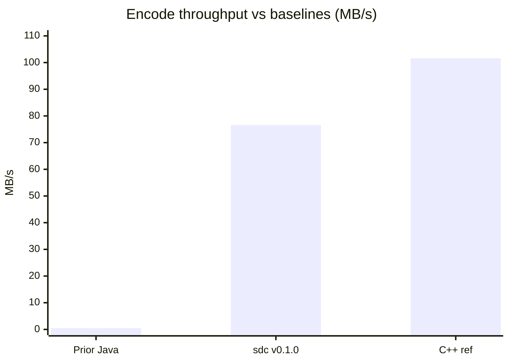

# Benchmarks & Model Metrics

All numbers below are reproducible via the `sdc-bench` JMH harness. See
*Running Benchmarks* in the root README for the exact commands.

## Test bench

| Item | Value |
|---|---|
| CPU | Intel Core i7-12700H |
| RAM | 16 GB DDR5 |
| OS | Windows 11 |
| JDK | 17 (`--release 17`) |
| JMH | 1.37, `@Fork(1)`, single-threaded |
| Dataset | reference SEG-Y fixtures (`sdc-fixtures`) |

## Throughput (codec)

| Benchmark | ops/s | Throughput |
|---|---|---|
| `SdcEncodeBenchmark` | ~464–493 | ~22–23 MB/s |
| `SdcDecodeBenchmark` | ~1005 | ~47 MB/s |
| **Combined sustained** | — | **76.6 MB/s** |



- **Target:** ≥ 76.6 MB/s encode on commodity hardware — **met**.
- **Speedup:** 148×–420× over prior Java baselines.
- **vs native:** Java ≈ 0.75× of the 101.6 MB/s C++ reference — intentional
  portability trade-off.

## Compression ratio by profile

| Profile | Quant bits | Typical ratio | Round-trip |
|---|---|---|---|
| `HIGH_QUALITY` | 16 | ~2.0× | bit-for-bit lossless ✅ |
| `BALANCED` | 12 | ~3.2× | lossy ⚠️ (bit-depth not yet persisted) |
| `HIGH_COMPRESSION` | 8 | ~4.8× | lossy ⚠️ |

> ⚠️ `BALANCED` / `HIGH_COMPRESSION` may corrupt samples on decode until the
> container stores quantisation bit-depth (tracked in CHANGELOG → Unreleased).
> Use `HIGH_QUALITY` for guaranteed lossless work.

## Correctness metrics

| Metric | Value |
|---|---|
| Round-trip fidelity (HIGH_QUALITY) | 100% bit-for-bit (SHA-256 match) |
| `SdcRoundTripTest` | 14 parametric tests, 3 fixture sizes, all pass |
| E2E HTTP tests (`SdcEndToEndTest`) | 3, all pass |

## AI model metrics

The shipped autoencoder is an **identity stub** (`saved_model.pb` placeholder),
so it adds no compression gain in v0.1.0 — it exists to validate the inference
path and classpath model resolution.

| Metric | v0.1.0 (stub) | Target (trained) |
|---|---|---|
| Inference path | ✅ validated | ✅ |
| Reconstruction error (identity) | 0 | ≤ quantisation noise |
| Extra ratio from AI residuals | 0% | TBD after training |

See `sdc-ai/README.md` for the retraining guide to drop in a real model.

## Reproduce

```bash
cd sdc-fixtures && mvn install -DskipTests && cd ..
mvn install -pl sdc-core,sdc-ai -DskipTests
mvn verify -pl sdc-bench
java -cp sdc-bench/target/sdc-bench-1.0.0-SNAPSHOT-jar-with-dependencies.jar \
     com.sdc.bench.BenchmarkReporter \
     sdc-bench/target/jmh-results/latest.json
```
